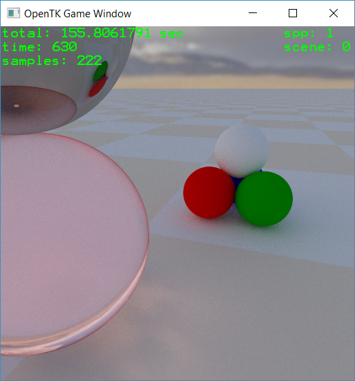
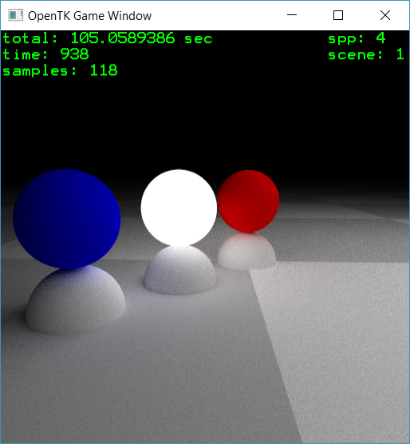
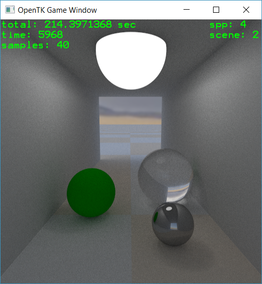
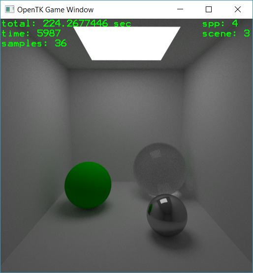
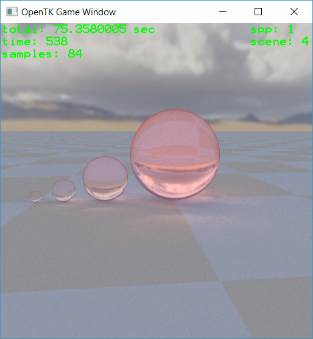
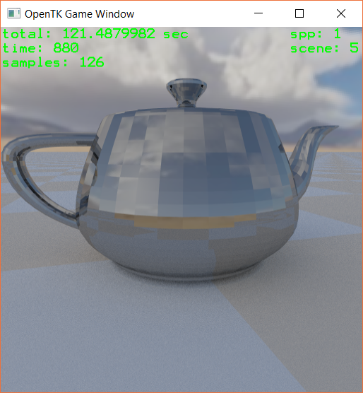
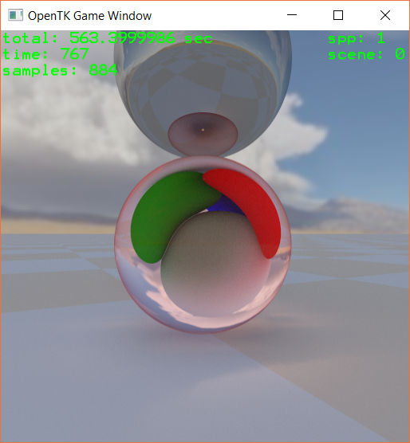

# C# Ray/Path tracer
## Features
* Whitted style ray tracer
* Monte Carlo path tracer
    * Next Event Estimation
    * Russian roulette
    * Surface lights (spheres, quads)
    * Anti-aliasing (multiple samples per pixel)
* Structures
    * Plane, sphere, triangle primitives
    * Bounding volume hierarchy data structure (automatic construction and traversal)
* Shading
    * Diffuse, specular, dielectric material properties
    * Predefined materials: air, glass, water, metal, light source
    * Bitmap textures
* Pixel accumulator
* Skybox
* Mesh loader (OBJ)
* Scene switcher
* Moveable first-person camera
* Parallelized ray calculation

## To do
* Improve render time per frame
* Add realistic camera (e.g. lens simulation for depth of field)
* Add more materials (e.g. micro-faceted)
* Etc

# Screenshots

